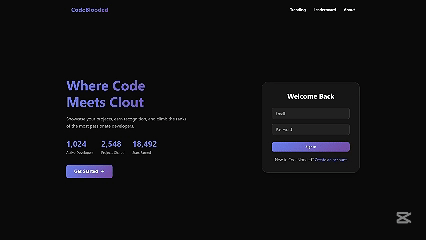
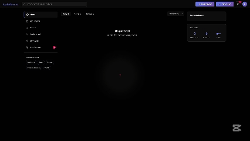
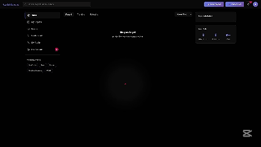
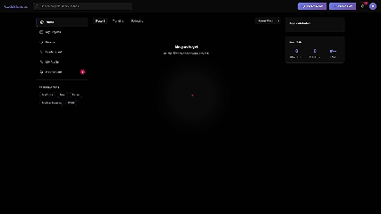

# CodeBlooded 🩸

<div align="center">

**Where code meets clout**

A developer community where your projects actually matter.

[](https://codeblooded.com)
[](https://github.com/dylangorrah/codeblooded)

</div>

---

## What's this?

Think Reddit,Linktin and Github hade a baby, for your side projects. It's where developers share what they build, earn reputation through real contributions, and connect without the corporate BS.

Your code speaks. Your projects shine. Simple as that.

<br>

---

## ⟐ See It In Action

### ⊶ Cursor Movement
smooth movement and clicking. Your cursor, but with a premium feel.


---

### ∿ Breathing Animation
Idle for 4 seconds? Watch the cursor come alive with a pulsing/Breathing animation.


---

### ⌘ Authentication Flow
From landing page to dashboard in seconds. Clean, smooth, validated.



---

### ⇌ Create a Post
Share your projects from the dashboard. Quick and intuitive.



---

### ⊡ Create a Room
Collaborative spaces for focused discussions/ Like Reddit's Theads.



---

### ◈ User Profile
Your developer identity. Clout, badges, projects—all in one place.



<br>

---

## ₪ What Makes This Special

**Clout System** — Reputation that actually means something. Post projects, get feedback, earn clout. No gaming the system - just real impact tracked over time. Progress from Novice to Legend.

**Achievements** — 25+ badges across different milestones. Bronze to Legendary. Some are secret. Unlock them and flex.

**Community** — Threaded conversations, project ratings, collaborative rooms. Notifications that matter.

**Dark UI** — Built for 2am coding sessions. Easy on the eyes. Smooth animations. Glass morphism that actually works.

**Responsive** — Desktop to mobile, no compromises. Touch-friendly. Adaptive layouts. Works everywhere.

<br>

---

## ⟐ Tech

| | |
|---|---|
| Frontend | HTML/CSS/JS |
| Backend | Supabase |
| Styling | Custom CSS |
| Deployment | Static ready |

<br>

---

## ◬ The Vibe

Minimal but expressive. Developer-centric. Community over vanity metrics. Every detail matters.

It feels like your favorite code editor came to life as a social platform.

<br>

---

## Put This Online with GitHub Pages (click-by-click)

Follow these steps to get the site live in a few minutes.

1) Get your Supabase keys ready
- **Project URL**: looks like `https://xxxx.supabase.co`
- **Anon key**: starts with `eyJ...` (this one is safe to use on the frontend)
- Never use the `service_role` key in the browser.

2) Create `config.js` in the site folder
- Go to `Code-Blooded/Code-Blooded/`
- Create a file named `config.js` with your values:

```html
<script>
  const CONFIG = {
    SUPABASE_URL: 'YOUR_PROJECT_URL',
    SUPABASE_ANON_KEY: 'YOUR_ANON_KEY'
  };
  if (typeof module !== 'undefined' && module.exports) {
    module.exports = CONFIG;
  } else {
    window.CONFIG = CONFIG;
  }
</script>
```

3) Arrange files for GitHub Pages
GitHub Pages can serve from the repo root or a folder named `docs`.
- Easiest: rename the inner folder `Code-Blooded/Code-Blooded` to `Code-Blooded/docs` so that `docs/index.html` exists.
- Your structure should look like:
  - `README.md`
  - `SUPABASE_SETUP.md`
  - `docs/index.html`
  - `docs/dashboard.html`
  - `docs/profile.html`
  - `docs/css/...`
  - `docs/js/...`
  - `docs/config.js` (with your URL + anon key)

4) Push to GitHub
- Create a new GitHub repo and push this project.

5) Turn on GitHub Pages
- In your repo: Settings → Pages
- Build and deployment → Source: "Deploy from a branch"
- Branch: `main` (or `master`) and Folder: `/docs`
- Click Save. Wait 1–2 minutes.

6) Get your live URL
- GitHub shows the site URL on the Pages screen.
- It will look like `https://<your-username>.github.io/<repo-name>/`

7) Tell Supabase about this URL
- In Supabase: Settings → Authentication → URL Configuration → Redirect URLs
- Add your GitHub Pages URL, for example:
  - `https://<your-username>.github.io/<repo-name>`
- Save changes.

8) Test it
- Open your live URL
- Register/login (check your email if confirmation is on)
- You should land on the dashboard without errors

Tips & Troubleshooting
- If you see auth redirects failing, double‑check the exact Pages URL is in Supabase Redirect URLs.
- If you see "table not found" errors, re-run the SQL in `SUPABASE_SETUP.md`.
- If you see 404s for files, make sure the site lives under `docs/` and that all links are relative (they already are).
- Only the Supabase "anon" key should be in `config.js`. Never put `service_role` in frontend code.

---

<div align="center">

Built with ❤️ by [Dylan Gorrah](https://github.com/Dylan-Gorrah)

*Because developers deserve better*

</div>
